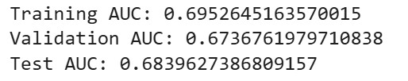

# Regression Modeling with H2O: Applying GLM and Artificial Neural Networks (ANN) for Predictive Accuracy  

### Basic Information

* **Person or organization developing model**: Patrick Hall, `jphall@gwu.edu` & N M Emran Hussain `nmemran.hussain@gwu.edu`
* **Model date**: June, 2025
* **Model version**: 1.0
* **License**: [Apache License 2.0](https://github.com/nmemranhussain/RML_A_1_Group_11/blob/main/LICENSE)
* **Model implementation code**: [Assignment_1](https://github.com/nmemranhussain/6290_PAI_1/blob/main/Assignment_1_final.ipynb), [Assignment_2](https://github.com/nmemranhussain/6290_PAI_1/blob/main/Assignment_2_final.ipynb)

### Intended Use
* **Primary intended uses**: This project is designed as educational and practical exercises to explore supervised machine learning techniques—specifically, Generalized Linear Models (GLM) and Artificial Neural Networks (ANN)—for solving regression problems using the H2O platform. The goal is to understand model formulation, data preprocessing, parameter tuning, model evaluation, and performance comparison. It serves as hands-on demonstrations of how to build predictive models on real-world tabular datasets, offering exposure to tools like H2O's Python interface, Colab integration, and model metrics such as RMSE and R². These projects are suitable for academic learning, prototyping predictive solutions, and developing foundational skills in automated machine learning systems.
* **Out-of-scope use cases**: This project is not intended for high-stakes, production-level deployment or decision-making in regulated or mission-critical environments (e.g., healthcare diagnostics, financial risk modeling, or autonomous systems). The models (GLM and ANN) are not intended for real-time, high-stakes automated decision-making without human oversight. Any use beyond an educational example is out-of-scope.

### Training Data

* **Data dictionary:**  

| Name | Modeling Role | Measurement Level | Description |  
| -------- | ---------------- | -------------------- | ------------- |  
| id | Identifier | Nominal | Unique identifier for each loan record. |  
| bad\_loan | Target | Binary | Indicates if the loan went bad (1 = bad loan, 0 = good loan). |  
| GRP\_REP\_home\_ownership | Predictor | Ordinal | Encoded home ownership category (grouped and possibly imputed). |  
| GRP\_addr\_state | Predictor | Nominal  | Encoded U.S. state of the borrower's address. |  
| GRP\_home\_ownership | Predictor | Ordinal | Encoded version of the borrower's home ownership status. |  
| GRP\_purpose | Predictor | Nominal  | Encoded purpose for which the loan was requested. |  
| GRP\_verification\_status | Predictor | Ordinal | Encoded borrower verification status (e.g., verified income). |  
| *WARN* | Not Used / Flag | Nominal | Placeholder for warnings during preprocessing (mostly NaNs). |  
| STD\_IMP\_REP\_annual\_inc | Predictor | Interval (Standardized) | Standardized and imputed annual income. |  
| STD\_IMP\_REP\_delinq\_2yrs | Predictor | Interval (Standardized) | Standardized and imputed count of delinquencies in past 2 years.|  
| STD\_IMP\_REP\_dti | Predictor | Interval (Standardized) | Standardized and imputed debt-to-income ratio. |  
| STD\_IMP\_REP\_emp\_length | Predictor | Interval (Standardized) | Standardized and imputed employment length. |  
| STD\_IMP\_REP\_int\_rate | Predictor | Interval (Standardized) | Standardized and imputed loan interest rate. |  
| STD\_IMP\_REP\_loan\_amnt | Predictor | Interval (Standardized) | Standardized and imputed loan amount. |  
| STD\_IMP\_REP\_longest\_credit\_lengt | Predictor | Interval (Standardized) | Standardized and imputed length of longest credit line. |  
| STD\_IMP\_REP\_revol\_util | Predictor | Interval (Standardized) | Standardized and imputed revolving credit utilization rate.|  
| STD\_IMP\_REP\_term\_length | Predictor | Interval (Standardized) | Standardized and imputed term length of the loan. |  
| STD\_IMP\_REP\_total\_acc | Predictor | Interval (Standardized) | Standardized and imputed total number of credit lines/accounts. |  

* **Source of training data**: [Loan_Clean.csv Trainning Datasets](https://github.com/jphall663/GWU_data_mining/blob/master/03_regression/data/loan_clean.csv)
* **How training data was divided into training and validation data**: In GLM-based Regression, the data was not explicitly split; however we tested out trained GLM model to generate a prediction for a new customer [GLM Test Data](https://github.com/nmemranhussain/6290_PAI_1/blob/main/GLM_test_data.jpg). For ANN, the datasets is divided into 40% training (65,595 rows), 30% validation (49,196 rows) and 30% test (49,196 rows). Like GLM, we tested our trained ANN model to generate a prediction for a new customer using [ANN_test_data](https://github.com/nmemranhussain/6290_PAI_1/blob/main/ANN_test_data.jpg)
* **Total number of rows and columns in the dataset**: The dataset contains 163,987 rows and 18 columns.
* **Any differences in columns between training and test data**: Yes, we used different dataset to generate a prediction for a new customer.

### Model details
* **Columns used as inputs in the final model**: 'GRP_REP_home_ownership', 'GRP_addr_state', 'GRP_purpose', 'GRP_verification_status', 'STD_IMP_REP_annual_inc', 'STD_IMP_REP_delinq_2yrs', 'STD_IMP_REP_dti', 'STD_IMP_REP_emp_length', 'STD_IMP_REP_int_rate', 'STD_IMP_REP_loan_amnt', 'STD_IMP_REP_longest_credit_lengt', 'STD_IMP_REP_revol_util', 'STD_IMP_REP_term_length' and 'STD_IMP_REP_total_acc'
* **Column(s) used as target(s) in the final model**: 'bad_loan'
* **Type of model**: Generalized Linear Model (GLM) and Artificial Neural Network (ANN) -based Regression model
* **Software used to implement the model and theors version:** H20 3.46.0.7 version, Python version: 3.11.13, Pandas version: 2.2.2, NumPy version: 2.0.2 and Matplotlib version: 3.10.0
* **Hyperparameters or other settings of the model**:  

For [Assignment_1](https://github.com/nmemranhussain/6290_PAI_1/blob/main/Assignment_1_final.ipynb)  

| Hyperparameters | Value(s) | Description |   
| -------- | ---------------- | -------------------- |   
| alpha | 0.01, 0.25, 0.5, 0.99 | Mix of L1/L2 regularization. |  
| lambda search | True | Enables automatic lambda tuning. |  
| family | binomial | Specifies binary logistic regression. | 

For [Assignment_2](https://github.com/nmemranhussain/6290_PAI_1/blob/main/Assignment_2_final.ipynb)

| Hyperparameters | Value(s) |  
| -------- | ---------------- |  
| Layers & Hidden Units | [170, 320], [80, 190], [320, 160, 80], [100], [50, 50, 50, 50] |  
| l1 | [0.0, 0.01, ..., 0.09] (steps of 's/1e4' for 's' in '0 to 900') |  
| l1 | [0.0, 0.001, ..., 0.009] (steps of 's/1e5' for 's' in '0 to 900') |  
| input_drop_out_ratio | [0.0, 0.02, ..., 0.18] (steps of 's/1e2' for 's' in '0 to 18') |  

### Quantitative Analysis  

* **Model Assessment:**  
Models were assessed primarily with the prediction for a new customer (where cut-off is 0.15) using [GLM Test Data](https://github.com/nmemranhussain/6290_PAI_1/blob/main/GLM_test_data.jpg) and [ANN_test_data](https://github.com/nmemranhussain/6290_PAI_1/blob/main/ANN_test_data.jpg):
  
| Model | Predict | P0 | P1 |  
| -------- | ---------------- | -------------------- | ------------- |  
| Genarlized Linear Model (GLM) | 1 | 0.185977 | 0.814023 |  
| Artificial Nueral Network (ANN) | 1 | 0.798559 | 0.201441 |  

* **Business decision from the prediction of models:**  
Based on the models prediction and a cutoff of 0.150, we should ‘not’ lend to this customer, as their probability of default (0.814023 for GLM and 0.201441 for ANN) exceeds the threshold, classifying them as a high-risk borrower.

* **Basic plots of our dataset:**

 
Figure 1. Basic Histograms 

 
Figure 2. Correlation Heat Map 

* **Plots for GLM model:**

  
Figure 3. Selected features and their coefficient values using GLM model

  
Figure 4. Penalized GLM coefficients paths (Elastic Net trace plot)

  
Figure 5. Actual vs. Predicted values for most important features using GLM model

* **Plots & tables for ANN model:**

 
Figure 6. Best ANN model with least log-loss 0.457155 and 100 hidden units  

 
Figure 7. ANN best model's training report  

 
Figure 8. ANN best model's Validation report  

 
Figure 9. Selected variables by best ANN model  

   
Figure 10. Best ANN model's train, validation and test AUC 

 
Figure 11. Iteration plot for best ANN model upto 10 epochs

### Ethical Consideration

The GLM model was trained and evaluated on the same dataset without an explicit validation or test split. This introduces a significant risk of overfitting, where the model may perform well on training data but poorly on unseen data. It could fails to simulate a real-world deployment scenario where generalization is crucial. The Artificial Neural Network introduces complex, nonlinear transformations with multiple hidden layers. ANN, more powerful than GLM, suffers from lack of interpretability. Stakeholders or regulators may find it difficult to understand or trust the model’s predictions, particularly in sensitive domains like credit scoring. The use of encoded features such as GRP_addr_state, home_ownership, or employment length can introduce biases related to geography, socioeconomic status, or employment history. If not handled properly, this can lead to discriminatory outcomes, especially in a financial lending context. The test datasets used for prediction (new customer scenarios) in both assignments were not drawn from the same distribution or preprocessed pipeline as the training set, which may lead to data leakage or invalid assumptions during prediction. Using a fixed threshold of 0.15 without business justification or risk modeling could exclude worthy applicants or include high-risk ones, depending on model calibration.

The models use features like state, employment length, and income—variables that may correlate with race, gender, or other protected attributes. Without fairness audits, the models might produce discriminatory outcomes, systematically disadvantaging certain groups. This violates principles of algorithmic fairness and legal compliance in financial services. ANN models, while powerful, lack transparency. In high-stakes domains (like loan approval), black-box models can’t justify why a customer was denied a loan. This reduces accountability and can harm user trust. If real customer data were used (even anonymized), one must ensure it was collected with informed consent and used under proper data governance. Educational use should strictly avoid exposing sensitive information.

In solution, we should split the dataset into training, validation, and test sets—even for simple models like GLM—to ensure generalizability and reduce overfitting risk. Use techniques like k-fold cross-validation when feasible. We should integrate fairness metrics (e.g., disparate impact, equal opportunity difference) into the model evaluation pipeline. If bias is detected, use mitigation strategies like reweighing, adversarial debiasing, or removing proxy variables. We should use tools such as SHAP, LIME, or H2O’s MOJO explainers to make ANN predictions more interpretable. These tools can highlight which features influenced a decision and by how much—enhancing transparency.

